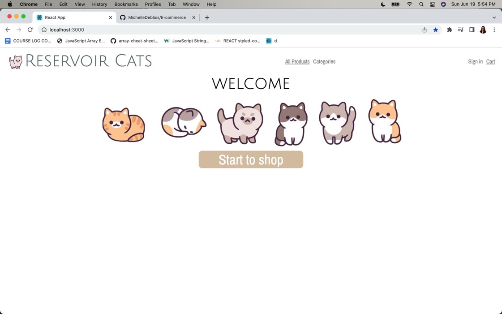
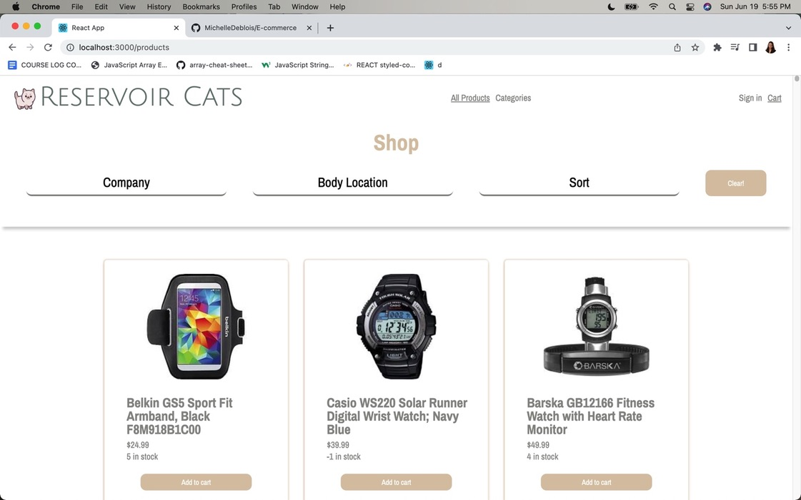
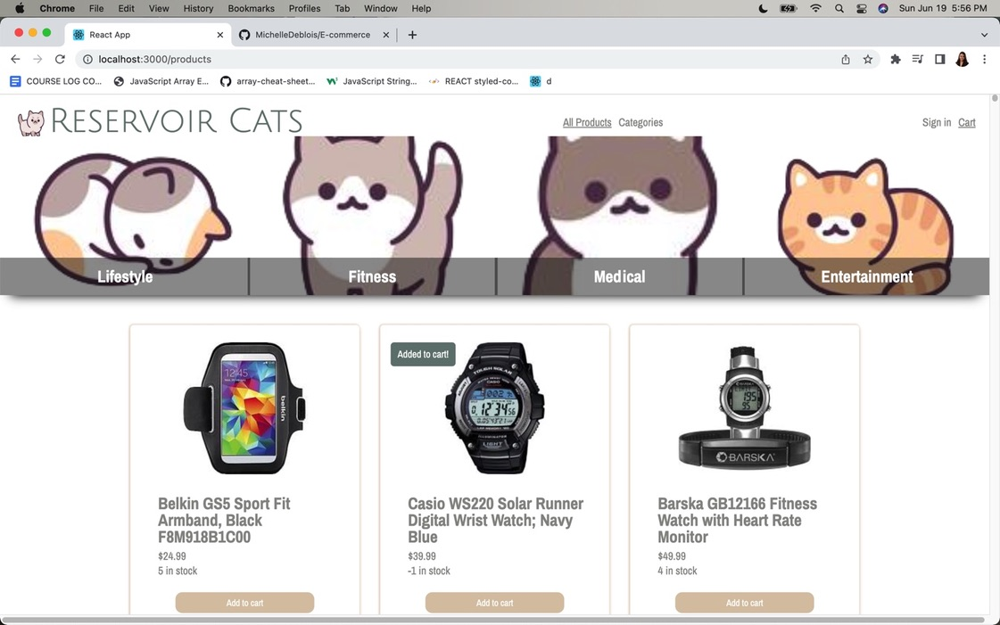
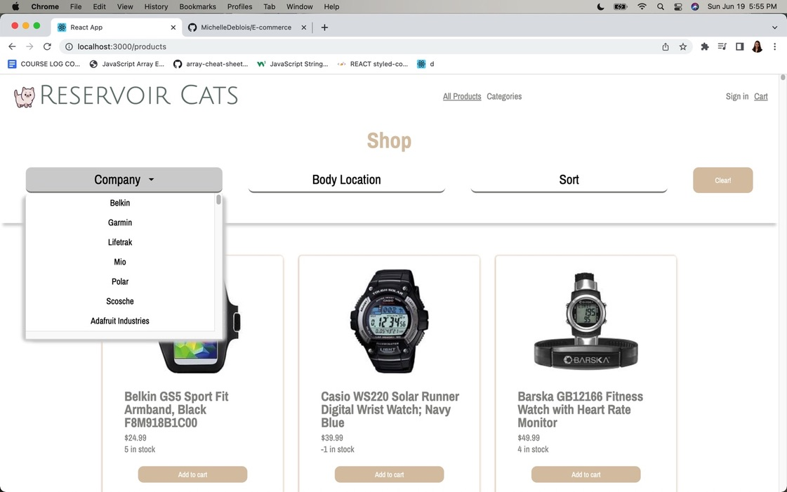
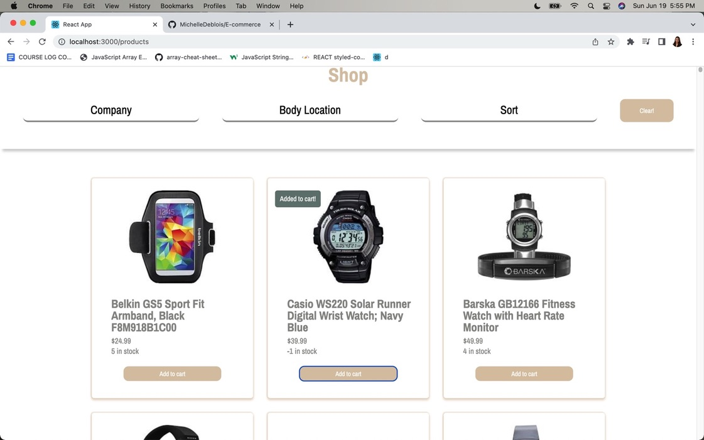
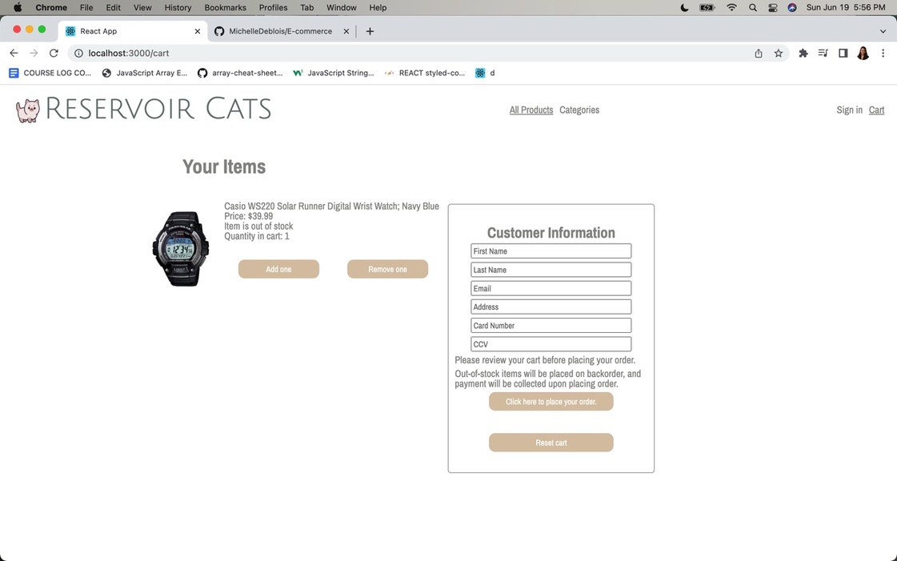
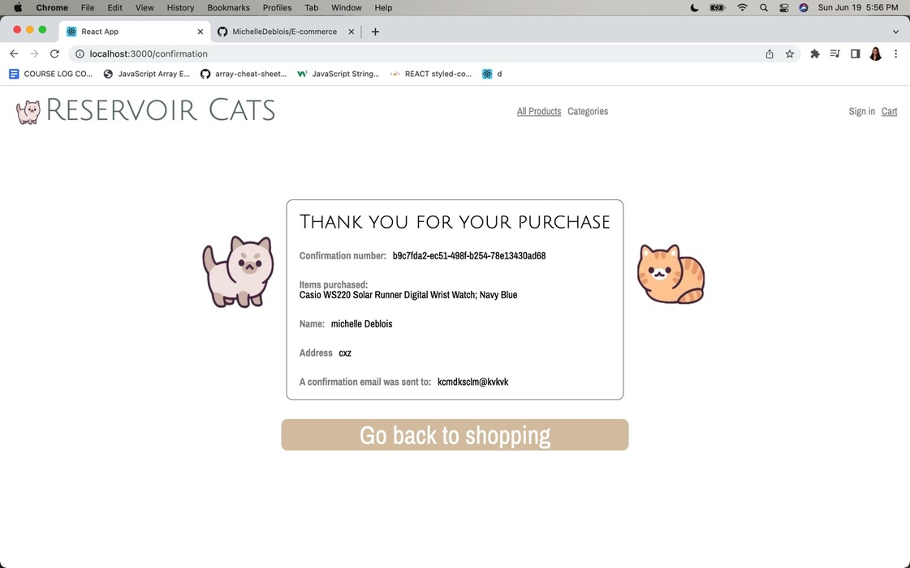

# Reservoir cat E-Commerce 

Wearables is an eComm platform where you can buy products, add them to your cart and place an order. 

The stack is React.Js, Node.Js, and styled-components.

Your node server is RESTful and follows REST principles.

## Local Development

To run the frontend:

- `cd client`
- `yarn install`
- `yarn start`

To run the backend (server):

- `cd server`
- `yarn install`
- `yarn start`

## Screen shot

you can shop my categories

you can sort by company

when the item has been added to your cart

your cart

purchase confirmation

